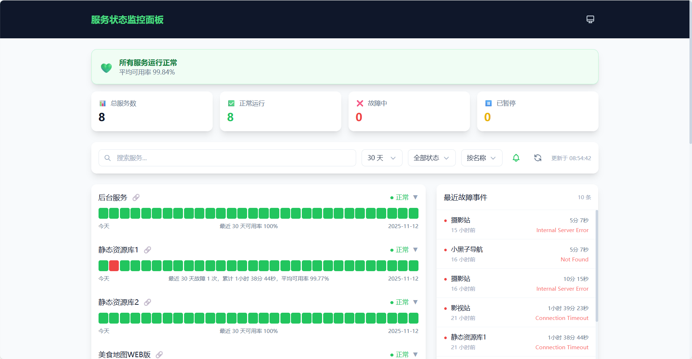

# 服务状态监控面板

中文 | [English](./README_EN.md)

基于 UptimeRobot API 的现代化服务状态监控面板。

演示地址：[https://status.javai.cn](https://status.javai.cn)

## 特性

- 🚀 **现代技术栈** - Vite + React 18 + TypeScript + TailwindCSS
- 📊 **数据可视化** - 可用率趋势图、响应时间图表（动态 Y 轴范围、主题适配 Tooltip）
- 🔔 **实时通知** - 浏览器通知（可开关）、页面标题状态提示
- 🌓 **主题切换** - 支持深色/浅色/跟随系统
- 📱 **响应式设计** - 完美适配移动端
- 🔍 **搜索筛选** - 按名称搜索、状态筛选（含暂停）、多种排序
- 📅 **时间范围** - 支持 30/60/90 天切换
- 📋 **故障历史** - 展示最近故障事件列表及原因（响应式布局）
- 🖼️ **嵌入模式** - 支持 iframe 嵌入其他页面
- 📲 **PWA 支持** - 可添加到桌面
- 🔤 **字体自适应** - 自动适配各平台最佳中文字体（苹方/微软雅黑等）
- 📈 **访问统计** - 集成不蒜子统计
- ♿ **无障碍支持** - 键盘导航、屏幕阅读器支持、跳过链接
- 🔄 **智能刷新** - 显示最后更新时间、loading 状态、自动重试

